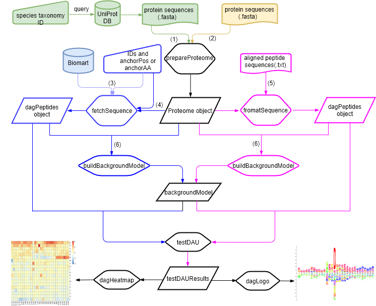

```{r echo=FALSE, results='hide', warning=FALSE, message=FALSE}
suppressPackageStartupMessages({
    library(dagLogo)
    library(biomaRt)
    library(UniProt.ws)
    library(motifStack)
    library(Biostrings)
    library(grDevices)
    })
```

# Introduction
A sequence logo has been widely used as a graphical representation of an alignment of multiple amino acid (AA) or nucleic acid sequences.
There is a package seqlogo[@Oliver2006] implemented in R to draw DNA sequence logos. 
And another package motifStack[@Jianhong2012] was developed for drawing sequence logos for protein, DNA and RNA sequences, which also has the capability for graphical representation of multiple motifs.

IceLogo[@Colaert2009] is a tool developed in Java to visualize significantly conserved sequence patterns in
an alignment of multiple peptide sequences against background sequences. Compare to 
webLogo[@Crooks2004], which relying on information theory, IceLogo builds on probability theory. It is
reported that IceLogo has a more dynamic nature and is more appropriate for analysis of
conserved sequence patterns.

However, IceLogo can only compare conserved sequences to reference sequences at the individual amino acid level. 
As we know, some conserved sequence patterns are not conserved at the individual amino acid level, but conserved at the level of amino acids grouped on the basis of their physical and chemical properties, such as charge, hydrophobicity and etc.

Here we developed a R/Bioconductor package dagLogo, inspired by IceLogo, to visualize significantly conserved sequence patterns relative to a proper background set of sequences, with or without grouping amino acid residuals based on their physical and chemical properties. The flowchart of performing dagLogo analysis is as shown in Figure 1. 
  
.

Figure 1. Flowchart of performing dagLogo analyses. The two ways to prepare a Proteome object are colored in greenish and yellowish. The two alternative ways to build an object of dagPeptides are colored in blue and red.

# Demonstration of dagLogo application

## Step 1: Fetching peptide sequences from the Biomart or UniProt database
### Case 1: You have both positions of the anchoring AAs and the identifiers of their enclosing peptide/protein sequences for fetching sequences using the fetchSequence() function via the Biomart.
```{r fetchSequences1, results='hide'}
##just in case biomaRt server does not response
if (interactive())
{
    try({
            mart <- useMart("ensembl")
            fly_mart <-
            useDataset(mart = mart, dataset = "dmelanogaster_gene_ensembl")
            dat <- read.csv(system.file("extdata", "dagLogoTestData.csv",
                                        package = "dagLogo"))
            seq <- fetchSequence(IDs = as.character(dat$entrez_geneid),
                                 anchorPos = as.character(dat$NCBI_site),
                                 mart = fly_mart,
                                 upstreamOffset = 7,
                                 downstreamOffset = 7)
            head(seq@peptides)
   })
}
```

### Case 2: You don't have the exactly position information, but You have the interesting peptide subsequences and the identifiers of their enclosing peptide/protein sequences for fetching sequences using the fetchSequence function via the Biomart. In the following example, the anchoring AAs are marked by asterisks.

```{r fetchSequences2, results='hide'}
if (interactive())
{
    try({
            mart <- useMart("ensembl")
            fly_mart <-
            useDataset(mart = mart, dataset = "dmelanogaster_gene_ensembl")
            dat <- read.csv(system.file("extdata", "dagLogoTestData.csv",
                                        package = "dagLogo"))
            seq <- fetchSequence(IDs = as.character(dat$entrez_geneid),
                                 anchorAA = "*",
                                 anchorPos = as.character(dat$peptide),
                                 mart = fly_mart,
                                 upstreamOffset = 7,
                                 downstreamOffset = 7)
            head(seq@peptides)
    })
}
```

In following example, the anchoring AAs are lower-cased "s" for amino acid serine. Readundant
input can be simplified using the helper function cleanPeptides().

```{r fetchSequences3, results='hide'}
if(interactive()){
    try({
            dat <- read.csv(system.file("extdata", "peptides4dagLogo.csv",
                                package = "dagLogo"))
            
            ## cleanup the data
            data <- unique(cleanPeptides(data, anchors = "s"))
            
            mart <- useMart("ensembl")
            human_mart <-
            useDataset(mart = mart, dataset = "hsapiens_gene_ensembl")
            seq <- fetchSequence(IDs = toupper(as.character(dat$symbol)),
                                type = "hgnc_symbol",
                                anchorAA = "s",
                                anchorPos = as.character(dat$peptides),
                                mart = human_mart,
                                upstreamOffset = 7,
                                downstreamOffset = 7)
            head(seq@peptides)
    })
}
```

If the anchoring AAs are not the same for each entry, they can be represented by lower-cased character of length (1).Readundant input can be simplified using the helper function cleanPeptides().

```{r fetchSequences4}
if(interactive()){
    dat <- read.csv(system.file("extdata", "peptides4dagLogo.csv",
                package="dagLogo"))
    dat <- unique(cleanPeptides(dat, anchors = c("s", "t")))
    mart <- useMart("ensembl", "hsapiens_gene_ensembl")
    seq <- fetchSequence(toupper(as.character(dat$symbol)), 
                         type="hgnc_symbol",
                         anchorAA=as.character(dat$anchor),
                         anchorPos=as.character(dat$peptides), 
                         mart=mart, 
                         upstreamOffset=7, 
                         downstreamOffset=7)
    head(seq@peptides)
}
```

Similarly, peptide sequences can be fetched from an predefined Proteome object by setting the parameter proteome to an Proteome object. 
  
  
### Case 3: You already have the aligned peptides sequences in hand. Then you can use the formatSequence function to prepare an object of dagPeptides. Before doing that, you need prepare a Proteome object by using the prepareProteome function.

```{r formatSequence, results='hide'}
dat <- unlist(read.delim(system.file("extdata", "grB.txt", package = "dagLogo"),
                        header = F, as.is = TRUE))
##prepare proteome from a fasta file
proteome <- prepareProteome(fasta = system.file("extdata",
                                                "HUMAN.fasta",
                                                package = "dagLogo"), 
                            species = "Homo sapiens")
##prepare an object of dagPeptides
seq <- formatSequence(seq = dat, proteome = proteome, upstreamOffset = 14,
                      downstreamOffset = 15)
```

## Step 2: Building background models  
Once you have an object of dagPeptides in hand, you can start to build a background model
for differential (grouped) amino acid usage (DAG) test. The background could be random subsequences 
from a whole proteome or your input.
If the background was built from a whole proteome, or a proteome excluding users' inputs, 
an object of Proteome is required. 

Sequences provided by a fasta file or downloaded from the UniProt database can be used to 
prepare a Proteome object.
Case 3 of Step 1 shows how to prepare a Proteome object from a fasta file. Here we show how to prepare an object of Proteome via the UniProt database.

```{r prepareProteome0}
if(interactive()){
    library(UniProt.ws)
    UniProt.ws <- UniProt.ws(taxId=9606)
    proteome <- prepareProteome(UniProt.ws=UniProt.ws)  ## Can be slow, be patient.
}
```

Then the proteome is used for background model building for Fisher's exact test or *Z*-test as follows. 

```{r buildBackgroundModel}
bg_fisher <- buildBackgroundModel(seq, background = "wholeProteome", 
                                  proteome = proteome, testType = "fisher")
bg_ztest <- buildBackgroundModel(seq, background = "wholeProteome", 
                                 proteome = proteome, testType = "ztest")
```

## Step 3: Testing differential (grouped) amino acid usage (DAG)
Tests can be done without making any change to the formatted, aligned amino acid symbols. Alternatively, amino acids can be grouped on the basis of their physical and chemical properties and the formatted, aligned amino acid symbols are replaced by new sets of symbols for each group, such as "P", "N" and "U" for amino acids with positive charge, negative charge and no charge if the amino acids are grouped based on their charge.  

```{r testDAU}
## no grouping
t0 <- testDAU(seq, dagBackground = bg_ztest)

## grouping based on properties of individual amino acids.
t1 <- testDAU(dagPeptides = seq, dagBackground = bg_ztest,
              groupingScheme = "chemistry_property_Mahler_group")

## grouped on the basis of charge.
t2 <- testDAU(dagPeptides = seq, dagBackground = bg_ztest, 
              groupingScheme = "charge_group")

## grouped on the basis of consensus similarity.
t3 <- testDAU(dagPeptides = seq, dagBackground = bg_ztest, 
              groupingScheme = "consensus_similarity_SF_group")

## grouped on the basis of hydrophobicity. 
t4 <- testDAU(dagPeptides = seq, dagBackground = bg_ztest, 
              groupingScheme = "hydrophobicity_KD")

## In case users prefer to use their own grouping scheme, dagLogo allows users
## to supply one as follows. The grouping scheme is named "custom_group" internally.
## For example, the following example demonstrates how to add a grouping scheme
## based on the level 3 of BLOSUM50.

color = c(LVIMC = "#33FF00", AGSTP = "#CCFF00",
          FYW = '#00FF66', EDNQKRH = "#FF0066")
symbol = c(LVIMC = "L", AGSTP = "A", FYW = "F", EDNQKRH = "E")
group = list(
    LVIMC = c("L", "V", "I", "M", "C"), 
    AGSTP = c("A", "G", "S", "T", "P"),
    FYW = c("F", "Y", "W"),
    EDNQKRH = c("E", "D", "N", "Q", "K", "R", "H"))
addScheme(color = color, symbol = symbol, group = group) 
t5 <- testDAU(dagPeptides = seq, dagBackground = bg_ztest, 
              groupingScheme = "custom_group")
```

## Step 4: Visualizing test results
We can use a heatmap or logo to display the test results.

```{r dagHeatmap,fig.cap="DAG heatmap",fig.width=8,fig.height=6}
##Plot a heatmap to show the results
dagHeatmap(t0) 
```

```{r dagLogo0,fig.cap="ungrouped results",fig.width=8,fig.height=6}
## dagLogo showing ungrouped AAs differentially used
dagLogo(t0) 
```

```{r dagLogo1,fig.cap="classic grouped",fig.width=8,fig.height=6}
## dagLogo showing AA grouped based on properties of individual amino acids.
dagLogo(t1, groupingSymbol = getGroupingSymbol(t1@group), legend = TRUE)
```

```{r dagLogo2,fig.cap="charge grouped",fig.width=8,fig.height=6}
## grouped on the basis of charge.
dagLogo(t2, groupingSymbol = getGroupingSymbol(t2@group), legend = TRUE)
```

```{r dagLogo3,fig.cap="chemistry grouped",fig.width=8,fig.height=6}
## grouped on the basis of consensus similarity.
dagLogo(t3, groupingSymbol = getGroupingSymbol(t3@group), legend = TRUE)
```

```{r dagLogo4,fig.cap="hydrophobicity grouped",fig.width=8,fig.height=6}
## grouped on the basis of hydrophobicity.
dagLogo(t4, groupingSymbol = getGroupingSymbol(t4@group), legend = TRUE)
```


# Session Info
```{r sessionInfo, echo=TRUE}
sessionInfo()
```

